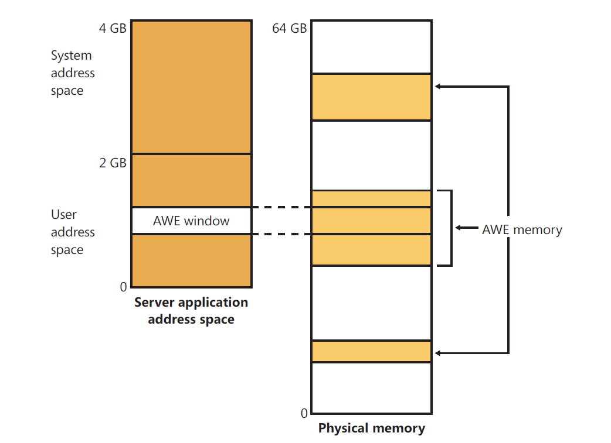

## 写在前面的只言片语

我将在这里简要讲述一下Windows操作系统。 Windows操作系统是我主要的工作环境，但其中涉及的一些概念在许多操作系统中都是通用的。

这里我首先列出我所能想到的内存管理的几个部分：
1. 虚拟内存与物理内存映射
2. 内存置换策略
3. 工作集
4. 物理内存管理

这是我首先想到的有关内存管理的几个部分，但对于成熟的内存管理来说这些显然不够。 如果需要设计一个内存管理系统的话，估计需要首先完成以下两个功能了：
1. 进程虚拟地址到物理地址映射
2. 当内存不够是如何把一些页面换入到磁盘中去

Windows内存管理分为以下几个组件：
1. 一套完善的内存分配、释放服务。这个服务大多会暴露API接口，是日常编程中可能会遇到的一组服务。
2. 错误和陷阱检测和处理程序，这部分程序保证每个虚拟地址空间为一个进程所独享。
3. 六个处于内核态的无敌线程：
	1. `balance set manager`(KeBalanceSetManager, priority 16) 这个线程在空闲的内存数量小于一个阀值时用来减少工作集的大小，扩充可用存储空间。
	2. `process/stack swapper`(KeSwapProcessOrStack, priority 23) 这个线程用来管理线程栈的换入和换出，线程调度程序和`balance set manager`都可能唤醒这个线程，来完成进程栈的换入换出操作。
	3. `modified page writer`(MiModifiedPageWriter, priority 17)，看名知意，这个就是将修改的内存写到合适的`page file`中去。这个线程在需要减少修改列表长度时被唤醒。
	4. `mapped page writer`(MiMappedPageWriter, priority 17)，将mapfile的文件写到合适的磁盘中。这个写过程可能只是给磁盘I/O或者缓存中，并没有真正写到磁盘中去，所以有可能发生页错误，这就需要第一个page writer来解决了：）
	5. `segment dereference thread` 被用作缩小缓存大小和控制page file大小
	6. `zero page thread`将内存初始化为0，针对`free list`的页面。

此外Windows 内存管理为了处理多处理器的情况，在修改许多全局状态时需要进行同步。这些锁使用`pushlock`实现(pushlock是一个内核级别的锁，与自旋锁不同，`pushlock`可以允许多个读资源共享，其他更深层的东西需要在另一部分进行总结)。

## Windows Memory Manager提供的服务
对于我们程序员来说，一般只关心Windows 所提供的服务有什么，然后通过调用相应的API接口就可以使用。

### 一些基本概念

#### Large & Small pages
这是Windows使用的一个技巧，使用large pages可以有效减少TLB中所需的Entry数量，从而更高效的执行。 需要注意的是Large Page有可能分配失败。由于Large page分配在物理存储上要求是对其的，如果无法对其就会返回失败。
同时，由于page file不支持Large page，所以这部分内存是Unpageable的

#### Reserving & Committing Pages
`Pages in a process virtual address space are free, reserved, committed, or shareable` 注意这句话，说明的是在进程虚拟内存空间是free，reserved和shareable。所以这里讨论的内存状态和实际的物理内存并没有什么关系，只是虚拟内存管理的一个状态。这里的内存管理主要是维护一个进程内部的地址空间。

我们可以通过调用系统函数`VirtualAlloc`或`VirtualAllocEx`等系统函数来reserve虚拟内存空间，然后在使用过程中再将这部分内存commit. 只reserve没有commit的地址空间是无法访问的。

`shared page`是共享区域的一个视图。 这个视图可以代表共享文件的一部分，或者代表page file的一部分。 这个概念还是很重要的，windows的许多高效通信机制就通过这个共享视图来实现。

Windows使用这种延迟的方式来减少分配内存所造成的开销。一个通常的场景是当一个线程创立时会reserve 一个1M的内存区域，但只commit第一个页。只有当访问超出这一部分的时候才会commit更多的页面。

#### Shared Memory & Mapped file
这部分功能是通过一个叫做`section object`的对象来实现。shared memory即通过mapped file来完成。mapped file的实现初衷是提出一种机制，不管数据是在文件、page file还是在内存中都能像在内存中一样去访问，其实是对虚拟地址空间的一个映射。完成虚拟空间的程序通常有`镜像加载`，`驱动程序`以及`缓存管理器`

#### Protection Memory
Windows 提供了4种内存保护方式。
1. 对于内核模式所定义的数据结构以及内存数据，只有在内核模式下才可以访问，用户模式无法进行访问。
2. 每个进程的地址空间都禁止其他进程进行读写或访问。共享内存并不是真正允许别的进程访问另一进程的地址空间。唯一的列外是该进程拥有对另一进程对象虚拟地址的读写权限，然后可以使用`ReadProcessMemory`以及`WriteProcessMemory`来对其他进程的内存进行访问。
3. 不同的处理器提供了不同的硬件内存保护。Windows API所提供的页面包含包括：
	1. PAGE_NOACCESS
	2. PAGE_READONLY
	3. PAGE_READWRITE
	4. PAGE_EXECUTE
	5. PAGE_EXECUTE_READWRITE*
	6. PAGE_EXECUTE_READ*
	7. PAGE_WRITECOPY
	8. PAGE_EXECUTE_WRITECOPY
	9. PAGE_GUARD
	10. PAGE_NOCACHE
	11. PAGE_WRITECOMBINE
4. Windows对于共享内存访问使用ACL来进行权限控制，从而阻止权限不够的内存访问。一旦线程打开了一个Handle，那么这个线程就有一定的权限来改变页面级的内存保护。但该改变不能违背ACL所设置的规则。

同时需要注意的是Windows 提供了一种叫做`No Execute Page Protection`的内存地址保护机制。该机制使得在执行标记成`NO EXECUTE`的页面上的
指令时会产生一个异常。这种方式使得在堆栈空间注入入侵代码变得不可能，从而阻止了一系列潜在的攻击。当这种情况发生时，在内核模式下系统会
crash，同时产生一个`ATTEMPTED_EXECUTE_OF_NOEXECUTE_MEMORY`错误代码，在用户模式下，其会产生称作`STATUS_ACCESS_VIOLATION(0xc0000005)`的异常。

在32bit的x86系统中PTE的第63bit被用来标记该页面是否可以被执行。所以对于32bit的系统来说，处理器必须运行在PAE模式下才能启用DEP(data execution prevention)保护。否则的话PTE只有32bit。

#### Address Windowing Extensions
AWE是Windows提供的一个功能，该功能提供了一个使32位处理器可访问多于4G地址空间的特性。使用这个特性一般需要从以下几个部分开始：
1. 分配内存空间。这里需要调用的函数有：`AllocateUserPhysicalPages`或者`AllocateUserPhysicalPagesNuma`。通过调用这些函数来分配一部分内存空间。
2. 分配一部分虚拟内存地址来供相应的内存使用。分配虚拟内存可以使用函数`VirtualAlloc`、`VirtualAllocEx`或者`VirtualAllocExNuma`并在分配时标记`MEM_PHYSICAL`。
3. 最后一步为了使用分配的内存空间，使用`MapUserPhysicalPages`或者`MapUserPhysicalPagesScatter`函数完成物理地址到虚拟地址的映射。

下图显示了AWE使用的一种情形。

使用AWS使得进程可以在虚拟地址空间中只分配一个比较小的窗口，而在物理地址上分配一个较大的内存，通过改变映射的位置从而使用户在32bit机器上可以访问多于2G的的内存空间。
AWE提供了一种保护机制。由于AWE中的内存是不可存储到`page file`中去的，使得拷贝`page file`来重现相应程序变得不可能。